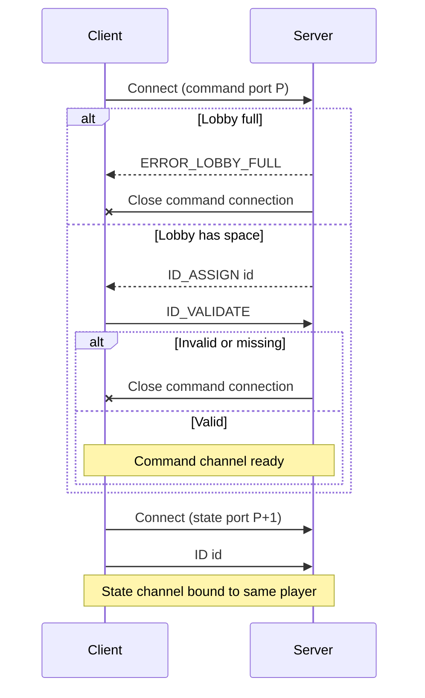
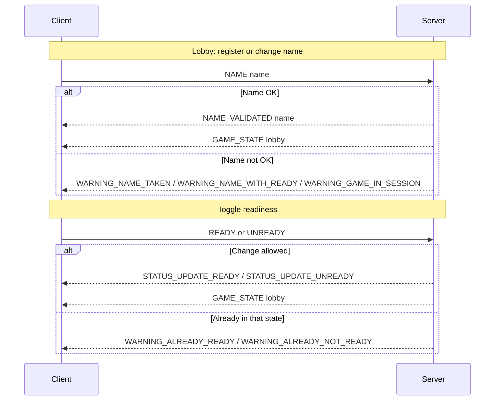
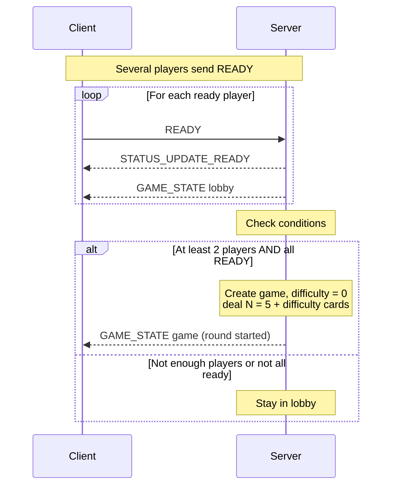
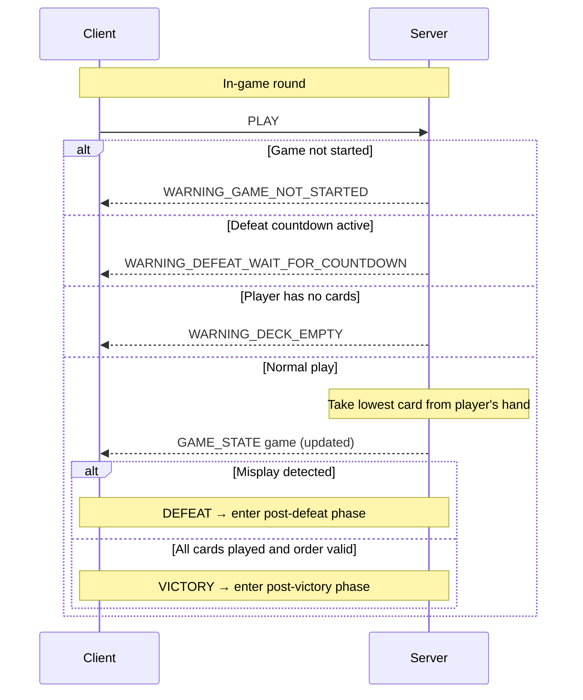
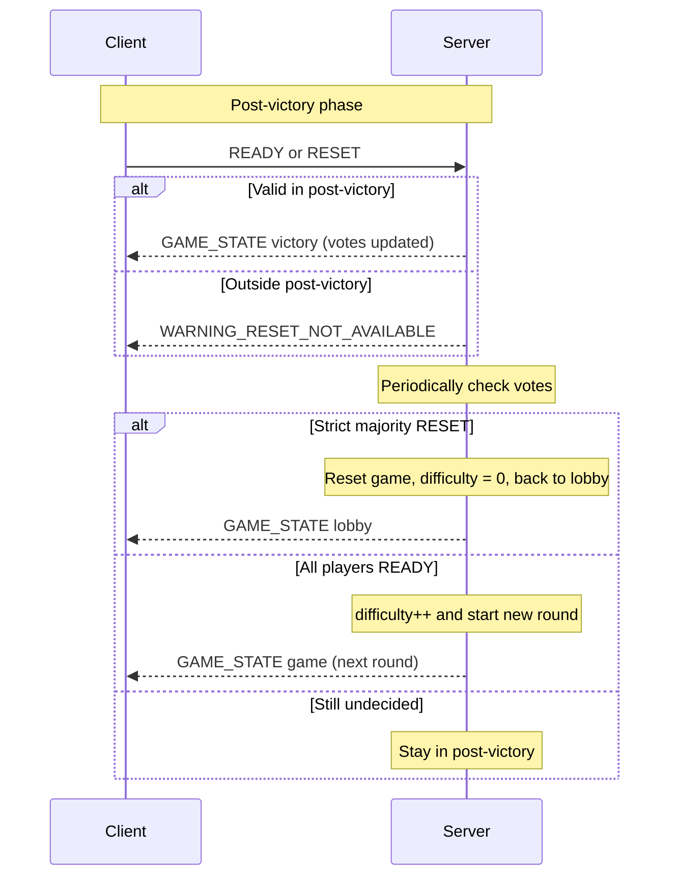
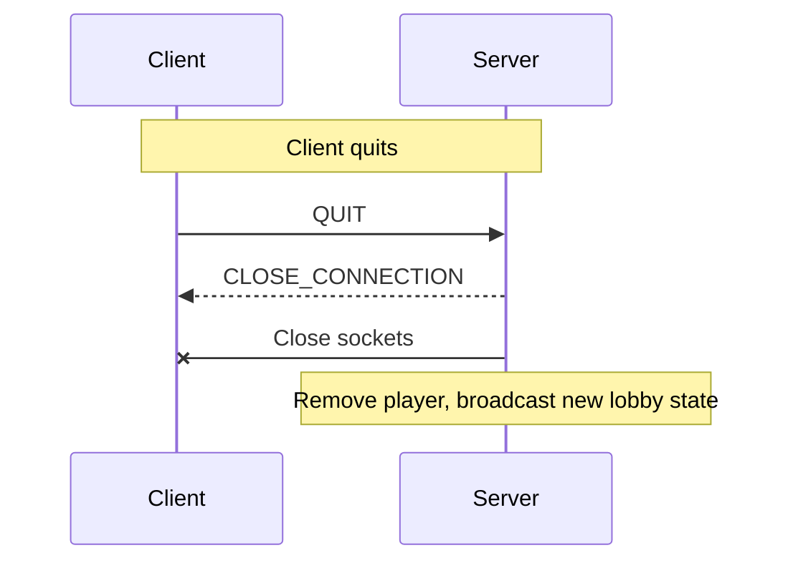

# Section 1 - Overview

The "The Mind" protocol is a client–server application protocol that allows up to 10 players to play a digital
version of the game "The Mind" in real time.

The server and each client use **two TCP connections**:

* A **command connection** for requests/replies (per client).
* A **state/broadcast connection** for lobby and game state updates (per client).

---

**Server tasks:**

* Listen for TCP connections on:

    * A **command port**.
    * A **state/broadcast port**.
* Manage player connections and the lobby (up to 10 simultaneous players; extra connections get rejected with an error).
* Assign a unique player ID to each connected client and validate it.
* Maintain a global lobby:

    * Track player names.
    * Track `READY` / `UNREADY` state.
    * Broadcast lobby state to all clients.
* Create and manage an instance of the "The Mind" game when:

    * There are at least 2 players, and
    * All connected players are `READY`.
* During the game:

    * Play the lowest card from a player’s hand when they send `PLAY`.
    * Validate each play (check order vs. remaining cards).
    * Detect `VICTORY` (all cards correctly played).
    * Detect `DEFEAT` (someone played a card higher than at least one card still in any hand).
    * Broadcast the updated game state to all clients.
* Handle **post-victory** phase:

    * Collect votes:

        * `READY` = vote to continue with increased difficulty (+1 card per player).
        * `RESET` = vote to reset to the main lobby, difficulty back to 0.
    * If *everyone* is `READY`: start next round at higher difficulty.
    * If *strict majority* votes `RESET`: reset the game and return to lobby.
* Handle **post-defeat** phase:

    * Broadcast defeat information.
    * Run a countdown.
    * Automatically reset game and return to lobby after a fixed delay.
* Handle errors and connection closure:

    * Reject extra players with `ERROR_LOBBY_FULL`.
    * Close connections on `QUIT` or fatal errors.

---

**Client tasks:**

* Connect to the server:

    * Command socket on `<host>:<port>`.
    * State socket on `<host>:(port+1)`.
* Complete handshake:

    * Receive `ID_ASSIGN <id>` on the command socket.
    * Reply `ID_VALIDATE` on the command socket.
    * Connect to the state socket and send `ID <id>` to bind that socket to the same player.
* Choose and register a name:

    * Send `NAME <name>` to the server.
    * The client may generate a random name if the user doesn’t provide one, but the protocol always sends `NAME <name>`.
* Control lobby/game state:

    * `READY` / `UNREADY` to toggle readiness in lobby and post-victory phases.
    * `PLAY` to play the lowest card from the player’s hand.
    * `RESET` to vote for resetting rounds and going back to the main lobby (post-victory only).
    * `QUIT` to quit and close the connection.
* Render UI:

    * Display lobby/game state updates received on the state socket.
    * Display server warnings and errors received on the command socket.

---

**Game ending conditions:**

* `VICTORY`:

    * All cards for the current round have been correctly played in ascending order.
    * The server enters a post-victory phase:

        * Players can `READY` to continue at higher difficulty.
        * Players can `RESET` to go back to lobby and reset difficulty.
* `DEFEAT`:

    * A misplay is detected (a played card is higher than at least one card still in some player’s hand).
    * The server enters a post-defeat phase:

        * Broadcasts defeat messages and a countdown to all clients.
        * Automatically resets and returns to lobby after the countdown.

---

# Section 2 - Protocol

The "The Mind" protocol is a line-based text protocol using TCP for reliable transmission and simple multithreaded
implementation (in this instance, via ExecutorService).

The server listens on:

* TCP port **P** for **command connections** (by default, `P = 6433`).
* TCP port **P+1** for **state/broadcast connections** (by default,`P+1 = 6434`).

All messages are UTF-8 encoded strings terminated by a newline character (`\n`, hereafter referred to as `END_OF_LINE`).

Messages follow this basic format:

* A command keyword in `UPPERCASE`, optionally followed by space-separated parameters.

The client initiates both TCP connections.

The server may handle multiple clients concurrently (multithreaded).

---

## Connection lifecycle

### 1. Command connection

1. The client connects to the **command port**.
2. If the lobby is full (10 players already connected):

    * The server sends:
      `ERROR_LOBBY_FULL <reason>`
      and closes the connection.
3. Otherwise:

    * The server assigns a new ID and sends:
      `ID_ASSIGN <id>`
    * The client must answer:
      `ID_VALIDATE`
    * If the client does not send `ID_VALIDATE`, or sends something else, the server closes the connection.
4. After `ID_VALIDATE`, the client may:

    * Register a name with:
      `NAME <name>`
    * Ask for readiness state changes:

        * `READY`
        * `UNREADY`
    * Request to play:

        * `PLAY`
    * Vote for full reset in post-victory phase:

        * `RESET`
    * Quit:

        * `QUIT`

The server replies to these commands with appropriate `ServerCommand` messages (ex: `NAME_VALIDATED`, `STATUS_UPDATE_READY`, `WARNING_*`, etc.) on the **command connection**.

---

### 2. State/broadcast connection

1. After receiving and validating `ID_ASSIGN <id>` / `ID_VALIDATE`, the client opens a second TCP connection to port **P+1**.
2. The client sends exactly one line:
   `ID <id>`
   where `<id>` matches the value previously received with `ID_ASSIGN`.
3. The server binds this state connection to the corresponding player session.
4. From this point on, the server can push state updates to the client via this connection, typically as:
   `GAME_STATE <base64-encoded-text>`

The base64 payload, once decoded, is a human-readable text block describing either:

* The **lobby state** (before/after a game), or
* The **live game state** (during a round), or
* **Victory/defeat/post-phase** messages.

The client is not expected to send further commands on the state connection after the initial `ID <id>` line.

---

## Lobby lifecycle

* New players join, get an ID, and eventually send `NAME <name>`.
* The server broadcasts lobby state to all players whenever a relevant change occurs (ex: name change, ready/unready, new player, player leaving).
* A player can change their name only when:

    * No game is currently running, and
    * They are not marked `READY`, and
    * The requested name is not already taken.

Relevant server behavior (on the command connection):

* On valid name change:

    * `NAME_VALIDATED <name>`
* On invalid actions:

    * `WARNING_NAME_TAKEN`
    * `WARNING_NAME_WITH_READY`
    * `WARNING_GAME_IN_SESSION`
    * `WARNING_DEFEAT_WAIT_FOR_COUNTDOWN` (if the server is in post-defeat countdown)

The lobby is continually mirrored to clients via `GAME_STATE <base64-lobby-text>` messages on the **state connection**.

When there are at least 2 players and **all** of them are `READY` (and the server is not in post-defeat or post-victory state):

* The server starts the first round (difficulty 0).

---

## Game lifecycle details

**Deck**:

* A game deck holds 100 unique cards, numbered from 1 to 100.
* At game creation, all cards 1..100 are created.
* For each player:

    * The server deals `N` distinct cards to the player’s hand (current implementation: `N = 5 + difficulty`).
* Undealt cards remain out of this game instance.

**Rounds and difficulty**:

* A "round" is characterized by a specific hand size per player: `5 + difficulty`.
* `difficulty` starts at 0.
* At each victory where players choose to continue:

    * `difficulty` is incremented by 1.
    * A new game is created with larger hands.

(There is no hardcoded maximum number of rounds in the current implementation.)

**Stack**:

* At the start of a round, the common stack is empty.
* When a `PLAY` command is accepted:

    * The server plays the **lowest card** from that player’s hand onto the stack.
    * The client does not specify the card value; the server decides which card is played.

**Misplay**:

* After a `PLAY`, the server checks:

    * Combine:

        * All cards already played (on the stack)
        * All cards still in all players’ hands
    * Sort all of them by value.
    * The subset corresponding to "played so far" must match the lowest values of the combined set in ascending order.
* If there exists a card in any hand that should have been played before the last played card (i.e. the sequence is not the minimal ascending prefix), the round is lost (`DEFEAT`).

**Victory**:

* When all players have no cards left and the sequence is still valid:

    * The round is won (`VICTORY`).
* The server:

    * Enters **post-victory phase**.
    * Resets all players’ `ready` and `reset` flags.
    * Broadcasts a `GAME_STATE <base64-text>` describing victory and instructing players:

        * `READY` to proceed to next round with increased difficulty.
        * `RESET` to vote for restarting to the main lobby.

**Post-victory vote handling**:

* If **strict majority** of players vote `RESET`:

    * The server resets:

        * Current game instance,
        * Difficulty (back to 0),
        * Player flags.
    * Returns to lobby (lobby `GAME_STATE` is broadcast).
* If **all** players are `READY`:

    * The server increments `difficulty` by 1.
    * Starts a new game with larger hands.
    * Broadcasts the new game state.

---

## Defeat lifecycle

On misplay:

* The server enters **post-defeat phase**:

    * Broadcasts a `GAME_STATE <base64-text>` indicating defeat and who caused it (if known).
    * Starts a countdown (here, 5 seconds).
* During the countdown:

    * The server periodically broadcasts updated defeat messages with remaining time.
    * Commands that would modify game or lobby state (ex: `NAME`, `READY`, `UNREADY`, `PLAY`, `RESET`) are generally rejected with:

        * `WARNING_DEFEAT_WAIT_FOR_COUNTDOWN`
* When the countdown reaches 0:

    * The server resets internal game state (similar to `gameReset()`):

        * Deletes the active game instance.
        * Clears `ready` and `reset` flags.
        * Resets difficulty.
        * Exits post-defeat phase.
    * Broadcasts a fresh lobby state using `GAME_STATE <base64-lobby-text>`.

---

## Errors and invalid messages

For invalid or out-of-context commands, the server responds on the **command connection** with appropriate warnings:

* Invalid / unknown command:

    * `WARNING_COMMAND_INVALID`
* Game not started yet:

    * `WARNING_GAME_NOT_STARTED`
* Game already in session (normal round):

    * `WARNING_GAME_IN_SESSION`
* Attempting actions during defeat countdown:

    * `WARNING_DEFEAT_WAIT_FOR_COUNTDOWN`
* Deck is empty for that player:

    * `WARNING_DECK_EMPTY`
* Name-related issues:

    * `WARNING_NAME_TAKEN`
    * `WARNING_NAME_WITH_READY`

* Readying-related issues:

    * `WARNING_ALREADY_READY`
    * `WARNING_ALREADY_NOT_READY`
* Reset not allowed outside post-victory phase:

    * `WARNING_RESET_NOT_AVAILABLE`

(Other warning types may exist in the enumeration but are not used by the current implementation.)

Warnings do not terminate the connection; they inform the client that the action was rejected.

---

## Connection closing

* A client may close the network connection at any time via:

    * Sending `QUIT` on the command socket, then closing the socket.
* The server may close a client connection when:

    * The client sends `QUIT` (after sending `CLOSE_CONNECTION`).
    * The lobby is full at connection time (`ERROR_LOBBY_FULL`).
    * A fatal internal error occurs (`ERROR_FATAL`).
    * Low-level I/O errors or protocol violations occur.

When a client disconnects:

* The server removes that player from the lobby.
* In post-defeat phase, if too few players remain, the server may immediately finalize defeat handling.
* A new lobby state is broadcast to remaining players via `GAME_STATE <base64-lobby-text>` on their state connections.

Here is the **fully adapted Section 3 – Messages**, rewritten to **exactly match your format**, including:

# Section 3 – Messages

## Register name

The client sends a message to register a player nickname.

***Request***

```
NAME: a randomly generated nickname. Cannot be changed while READY or during certain game phases.
NAME <name>: the desired nickname. Must be unique. Cannot be changed while READY or during certain game phases.
```

***Response***

* If successful:

```
NAME_VALIDATED <name>: the name was successfully registered.
```

* Else:

```
WARNING_NAME_TAKEN: another player already uses this name.
WARNING_NAME_WITH_READY: the player is marked READY and must UNREADY before renaming.
WARNING_GAME_IN_SESSION: renaming is not allowed during an active round.
WARNING_DEFEAT_WAIT_FOR_COUNTDOWN: renaming is not allowed during defeat countdown.
```

---

## Mark ready

The client informs the server that it is ready to start or continue a round.

***Request***

```
READY
```

***Response***

* If successful:

```
STATUS_UPDATE_READY: the ready state was updated successfully.
```

* Else:

```
WARNING_ALREADY_READY: the player was already ready.
WARNING_GAME_IN_SESSION: the ready state cannot be changed during an active round.
WARNING_DEFEAT_WAIT_FOR_COUNTDOWN: ready changes are not allowed during defeat countdown.
```

---

## Mark unready

The client indicates that it is no longer ready.

***Request***

```
UNREADY
```

***Response***

* If successful:

```
STATUS_UPDATE_UNREADY: the unready state was updated successfully.
```

* Else:

```
WARNING_ALREADY_NOT_READY: the player was already unready.
WARNING_GAME_IN_SESSION: cannot unready during an active round.
WARNING_DEFEAT_WAIT_FOR_COUNTDOWN: unready is not allowed during defeat countdown.
```

---

## Play a card

The client requests to play its lowest card.
The server determines the actual value; the client does not specify it.

***Request***

```
PLAY
```

***Response***

* If successful:

```
CARD_PLAYED <value>: the player's lowest card was played successfully.
```

Additionally, the server emits:

```
GAME_STATE <base64-text>: updated game or lobby state.
```

* Else:

```
WARNING_GAME_NOT_STARTED: a play was attempted before a round started.
WARNING_GAME_IN_SESSION: the request was issued in a restricted phase.
WARNING_DECK_EMPTY: the player has no cards left to play.
WARNING_DEFEAT_WAIT_FOR_COUNTDOWN: plays are not allowed during defeat countdown.
WARNING_COMMAND_INVALID: the request was malformed or invalid.
```

---

## Vote for reset

The client votes to reset the game to the main lobby.
Valid only after a victory.

***Request***

```
RESET
```

***Response***

* If successful:

```
RESET_ISSUED: the reset vote was recorded.
```

* Else:

```
WARNING_RESET_NOT_AVAILABLE: reset is only allowed after a victory.
WARNING_DEFEAT_WAIT_FOR_COUNTDOWN: reset is not allowed during defeat countdown.
```

---

## Quit

The client requests a clean disconnection.

***Request***

```
QUIT
```

***Response***

```
CLOSE_CONNECTION: the server acknowledges the quit request and closes all connections.
```

---

## Assign player ID

The server assigns a unique ID immediately after a client connects to the command socket.

***Response***

```
ID_ASSIGN <id>: a unique player ID has been assigned.
```

The client must reply:

```
ID_VALIDATE
```

If `ID_VALIDATE` is not received, the server closes the connection.

---

## Lobby and game state updates

The server sends the lobby view, game state, victory screen, or defeat countdown on the state socket.

***Response***

```
GAME_STATE <base64-text>: contains the encoded current state.
```

---

## General warnings

The server emits warnings for invalid, malformed, or forbidden client actions.

***Response***

```
WARNING_COMMAND_INVALID: the message was unknown or incorrect.
WARNING_GAME_NOT_STARTED: the action requires an active game.
WARNING_GAME_IN_SESSION: the action is not allowed while a round is in progress.
WARNING_DECK_EMPTY: the player attempted PLAY with no cards remaining.
WARNING_NAME_TAKEN: attempted rename to an existing name.
WARNING_NAME_WITH_READY: rename attempted while the player is READY.
WARNING_ALREADY_READY: the player was already marked ready.
WARNING_ALREADY_NOT_READY: the player was already not ready.
WARNING_RESET_NOT_AVAILABLE: RESET attempted outside post-victory.
WARNING_DEFEAT_WAIT_FOR_COUNTDOWN: the action is not allowed during defeat countdown.
```

---

## Lobby full

The server rejects new players when the lobby is full.

***Response***

```
ERROR_LOBBY_FULL lobby_full: no additional players may join.
```

The server then closes the connection.

---

## Fatal error

The server encountered an unrecoverable issue.

***Response***

```
ERROR_FATAL: the server is shutting down or terminating all clients.
```


# Section 4 - Examples (mermaid diagrams)

## Connection Setup (Two TCP Sockets)


## Lobby: Names and READY / UNREADY




## Start of Game from Lobby




## Game Round – PLAY Logic




## Post-Victory Voting (READY vs RESET)




## Post-Defeat Countdown


